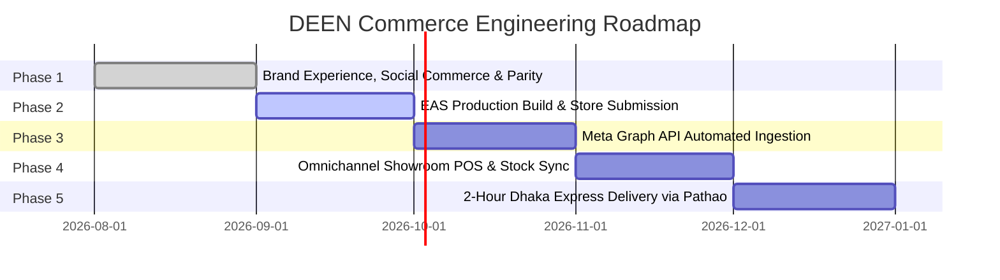

# DEEN Commerce Product & Engineering Roadmap

## 1. Roadmap Overview

This roadmap defines the strategic milestones for DEEN Commerce across engineering, logistics, customer experience, and omnichannel retail operations in Bangladesh.

---

## 2. Release Phases

---

### Phase 1: Brand Experience, Social Commerce & Parity (COMPLETED)
- Verified official brand social media integration (Facebook, Instagram, LinkedIn, WhatsApp).
- Dynamic Motion Hero and Heritage Craftsmanship story modules.
- Social Reels Carousel with 1-tap "Quick Bag" and PDP exploration.
- 5-tab customer navigation and elimination of customer-facing admin lock screens.
- Monorepo feature parity across Web and Mobile with 100% type safety and 44 automated tests passing.

---

### Phase 2: EAS Production Build & App Store Releases (IN PROGRESS)
- **Android APK & AAB**: Production bundle signing via EAS (`eas build --platform android --profile production`).
- **Google Play Store**: App listing submission, target SDK 34 compliance, data safety questionnaire.
- **Apple App Store**: iOS TestFlight distribution, provisioning profiles, privacy manifest compliance.
- **Push Notification Infrastructure**: Production FCM / APNs credentials configuration for real-time delivery tracking alerts.

---

### Phase 3: Meta Graph API Automated Synchronization
- Connect official Instagram Business account to Fastify gateway.
- Automated media ingestion and reel sync via `0 3 */14 * *` token refresh cron.
- Webhook endpoints (`POST /v1/deen/social/webhook`) for instant cache invalidation upon publishing new collections.

---

### Phase 4: Omnichannel Showroom Inventory Synchronization
- Real-time stock integration with physical showrooms:
  - **Mirpur 12 Flagship Outlet** (Ramzannesa Super Market, Mirpur 12)
  - **Wari Showroom** (Dhaka South)
  - **Cumilla Showroom**
  - **Sylhet Showroom**
- "Reserve in Store" capability: Customers can reserve waist sizes for 24 hours at their nearest showroom.

---

### Phase 5: Hyperlocal 2-Hour Dhaka Express Delivery
- Direct integration with Pathao Instant On-Demand Rider API.
- Automated courier dispatch within 15 minutes of order placement for eligible Dhaka metro zones.
- Real-time rider GPS tracking embedded directly inside the in-app Order Stepper.
