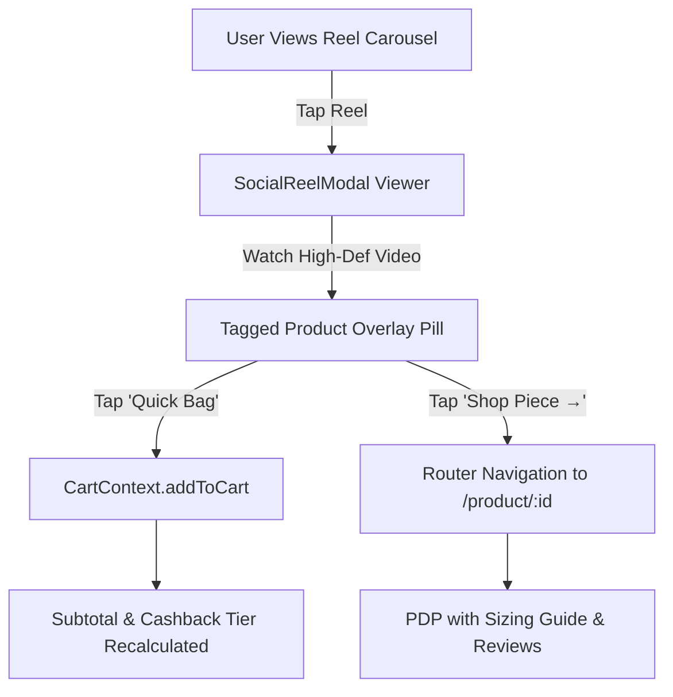

# Social Media Integration & 1-Tap Social Commerce Architecture

## 1. Executive Summary & Policy Compliance

Modern high-converting fashion commerce blends lifestyle social media content with instant friction-free purchasing. 

To deliver a premium experience while strictly complying with Meta Platform Terms and preventing client degradation:
1. **Zero Scraping Policy**: The client mobile and web apps **never** scrape Instagram or Facebook web pages. Scraping trips IP rate limits, violates Terms of Service, risks domain blacklisting, and causes fragile UI breakage.
2. **Backend-Driven Architecture**: All social media feeds, reels, and stories are aggregated and served through the high-performance Fastify Gateway proxy (`GET /v1/deen/social/feed`).
3. **1-Tap Social Commerce**: Social reel assets feature embedded product tags that allow users to either Quick Bag a product variation directly into their cart in 1 tap or inspect detailed craftsmanship specs on the Product Detail Page (PDP).

---

## 2. Gateway API Proxy Contract

### Endpoint: `GET /v1/deen/social/feed`
- **Gateway Caching**: 15-minute in-memory TTL with stale-while-revalidate protection.
- **Upstream Resilience**: In the event of upstream API delay, the gateway returns the verified cached feed immediately.

### Schema Definition:
```typescript
export interface SocialAccount {
  platform: "facebook" | "instagram" | "linkedin" | "whatsapp";
  username: string;
  url: string;
  followerCount: string;
  description: string;
  badge: string;
}

export interface TaggedCommerceProduct {
  id: string;
  name: string;
  price: number;
  regularPrice: number;
  image: string;
  category: string;
  inStock: boolean;
}

export interface SocialReel {
  id: string;
  platform: "instagram" | "facebook";
  title: string;
  caption: string;
  thumbnail: string;
  videoUrl: string;
  durationSeconds: number;
  views: string;
  likes: string;
  taggedProduct?: TaggedCommerceProduct;
  createdAt: string;
}

export interface SocialFeedResponse {
  brand: string;
  handle: string;
  verified: boolean;
  officialAccounts: Record<string, string>;
  reels: SocialReel[];
  stories: Array<{
    id: string;
    title: string;
    thumbnail: string;
    badge: string;
  }>;
}
```

---

## 3. Client Service Abstraction

Both mobile and web utilize an isolated, resilient client service:
- **Mobile**: `apps/mobile/src/services/socialContent.ts`
- **Web**: `apps/web/lib/socialContent.ts`

### Fallback Guarantee
If the network is completely offline or the gateway is temporarily unreachable, the service falls back gracefully to a curated offline bundle of authentic DEEN shuttle-loom selvedge video assets and brand stories, preventing any blank screens or broken layouts.

---

## 4. 1-Tap Commerce Pipeline



1. **Quick Bag**: Bypasses full screen transitions. Appends the tagged product with size `32` (most popular Bangladeshi denim waist) directly to the cart, triggers an animated confirmation snackbar, and recalculates cashback progression.
2. **Deep Inspection**: Clicking "Shop Piece" routes directly to `/product/[id]` with full size selector, fit guidance, and 7-day doorstep exchange guarantee details.

---

## 5. Meta Graph API Roadmap & Production Integration

For direct automated synchronization with DEEN's official Instagram Business and Facebook Pages:

### 5.1 Required Permissions & Scopes
1. `instagram_basic`: Read basic metadata, profile information, and media objects.
2. `instagram_manage_insights`: Retrieve view counts, impression analytics, and engagement.
3. `pages_show_list`: Enumerate managed brand business accounts.
4. `pages_read_engagement`: Ingest likes, comments, and engagement metrics.

### 5.2 Token Refresh Lifecycle
- **Long-Lived User Access Token**: Obtained via OAuth exchange, valid for 60 days.
- **Automated Refresh Cron**: Fastify gateway executes a scheduled bi-weekly cron job (`0 3 */14 * *`) calling `GET https://graph.instagram.com/refresh_access_token?grant_type=ig_refresh_token&access_token={token}` to continuously rotate tokens without human intervention.

### 5.3 Webhook Event Processing
- Register Fastify endpoint `POST /v1/deen/social/webhook` with Meta Webhook verification token.
- Listen for `media_publish` events to immediately invalidate the in-memory cache and pull newly published reels.

---

## 6. Official Brand Social Channels Reference

| Platform | Official URL | Verified Handle | Purpose |
| :--- | :--- | :--- | :--- |
| **Facebook** | `https://www.facebook.com/deencommerce` | `@deencommerce` | Official brand community, live events |
| **Instagram** | `https://www.instagram.com/deencommerce/?hl=en` | `@deencommerce` | Daily styling, reels, collection launches |
| **LinkedIn** | `https://www.linkedin.com/company/deencommerce` | `deencommerce` | Corporate, career openings, wholesale |
| **WhatsApp** | `https://wa.me/8801952700500` | `+880 1952-700500` | Instant styling concierge, order swap help |
